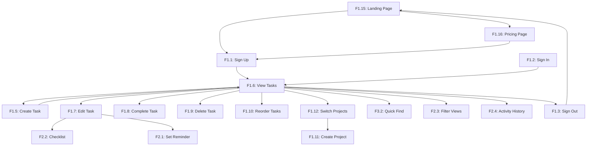

# Core Flows: Marrow Tasker

## Overview

This document maps every user flow required for the Marrow Tasker MVP. Flows are organized by priority:

- **Priority 1**: Core functionality that must work flawlessly — authentication, task CRUD, project management, and the four-section task view. These flows receive comprehensive testing with edge cases.
- **Priority 2**: Important but secondary — reminders, filters, activity history, landing/pricing pages. Happy path coverage.
- **Supporting**: Nice-to-have polish — animations, keyboard shortcuts, drag-and-drop refinements. Happy path only.

References: __@Epic Brief: Marrow Tasker__

---

## Priority 1: Authentication & Onboarding

### F1.1: User Sign-Up (Free Tier)

**Description**: A new user creates a Free tier account with email verification via Clerk.

**Trigger**: User clicks "Get Started Free" on the landing page or "Sign Up" in the navigation.

**Flow**:

1. User is redirected to Clerk's sign-up component (embedded in `/sign-up` route).
2. User enters email address and password (or chooses social auth if configured).
3. Clerk sends a verification email via Resend integration.
4. User clicks the verification link in their email.
5. Clerk confirms email verification and creates the user session.
6. System creates a corresponding user record in Neon database with Free tier defaults (1 project limit, 1 filter view, 1-week activity history).
7. System creates a default "Personal" project for the user.
8. User is redirected to the Task Management page (`/app`) with their default project active.
9. System displays a brief welcome tooltip or onboarding hint: "Add your first task above."

**Exit**: User is authenticated, has a default project, and sees the empty Task Management page ready for input.

**Variations**:
- Social auth (Google/GitHub) → skip email verification step, proceed from step 5
- Email already registered → Clerk shows "Account already exists" with link to sign-in
- Verification link expired → Clerk provides "Resend verification" option

---

### F1.2: User Sign-In

**Description**: An existing user signs into their account.

**Trigger**: User clicks "Sign In" in the navigation or visits `/sign-in`.

**Flow**:

1. User is presented with Clerk's sign-in component (embedded in `/sign-in` route).
2. User enters email and password (or chooses social auth).
3. Clerk authenticates the user and creates a session.
4. System fetches the user's data from Neon via TanStack DB (projects, tasks, preferences).
5. TanStack DB syncs the user's collections to the client.
6. User is redirected to the Task Management page (`/app`) with their last-active project tab selected.

**Exit**: User is authenticated and sees their Task Management page with all data loaded.

**Variations**:
- Wrong password → Clerk shows error, offers password reset
- Account locked → Clerk shows lockout message with support contact
- Session still active (returning user) → auto-redirect to `/app`, skip sign-in

---

### F1.3: User Sign-Out

**Description**: User signs out of their account.

**Trigger**: User clicks their avatar/profile menu and selects "Sign Out."

**Flow**:

1. User clicks the profile avatar in the top-right corner of the app header.
2. A dropdown menu appears with options including "Sign Out."
3. User clicks "Sign Out."
4. Clerk clears the session and any client-side tokens.
5. TanStack DB clears local collections.
6. User is redirected to the landing page (`/`).

**Exit**: User is signed out, local data is cleared, and they see the landing page.

---

### F1.4: Password Reset

**Description**: User resets their forgotten password.

**Trigger**: User clicks "Forgot Password?" on the sign-in page.

**Flow**:

1. User clicks "Forgot Password?" link on the Clerk sign-in component.
2. Clerk shows email input field.
3. User enters their registered email address.
4. Clerk sends a password reset email via Resend.
5. User clicks the reset link in their email.
6. Clerk shows password reset form (new password + confirm).
7. User enters new password and submits.
8. Clerk confirms password change and redirects to sign-in.
9. User signs in with new password (see F1.2).

**Exit**: User has a new password and can sign in.

---

## Priority 1: Task Management — Core CRUD

### F1.5: Create a Task (Quick Add)

**Description**: User creates a new task using the top "Add Task" section.

**Trigger**: User clicks the "Add Task" input area or presses a keyboard shortcut (e.g., `N` or `Q`).

**Flow**:

1. User clicks the "Add Task" area at the top of the Task Management page (Section 1).
2. The area expands into an inline form with fields:
   - **Task name** (required, text input, auto-focused)
   - **Description** (optional, expandable textarea)
   - **Date** (optional, date picker — default: no date)
   - **Reminder** (optional, dropdown: "None", "Add to Calendar", "Email Reminder" with time picker)
   - **Project** (dropdown, pre-selected to current active project tab)
3. User types the task name.
4. User optionally fills in description, date, reminder, and project.
5. User presses Enter or clicks "Add Task" button.
6. System creates an optimistic mutation via TanStack DB — task immediately appears in the UI.
7. TanStack DB syncs the new task to Neon via ElectricSQL.
8. The input form resets, ready for the next task.
9. The new task appears at the **top** of the appropriate section:
   - No date → Section 2 (Task List), at the top
   - Date is today or past → Section 2 (Task List), at the top
   - Date is this week (future day) → Section 3 (Weekly View), in the correct day column
   - Date is beyond this week → Section 4 (Future Tasks), at the top of that section

**Exit**: Task is created, visible in the correct section, and synced to the server.

**Variations**:
- Empty task name → show validation error "Task name is required"
- Keyboard shortcut `Enter` while typing → creates task (Shift+Enter for newline in description)
- Quick add with just a name (no other fields) → task created with defaults (no date, no reminder, current project)

**Note**: "Smart Quick Add" on the Free tier means a convenient inline form with optional fields (date, reminder, project) that stays open for rapid entry. Natural language date parsing (e.g., typing "Buy groceries tomorrow" auto-detects "tomorrow") is a future enhancement, not required for MVP.

---

### F1.6: View Tasks (Four-Section Layout)

**Description**: User views their tasks organized across four temporal sections.

**Trigger**: User navigates to the Task Management page (`/app`) or switches project tabs.

**Flow**:

1. System loads tasks for the active project (or all projects if "All" tab is selected) via TanStack DB live queries.
2. Tasks are organized into four sections:

   **Section 1 — Add Task** (persistent at top):
   - Always visible inline task creation form (see F1.5).

   **Section 2 — Task List** (undated, overdue, and today):
   - Contains tasks with no date set, tasks with due dates in the past (overdue), and tasks due today.
   - Ordered FIFO (newest at top) by default, but user can manually reorder via drag-and-drop.
   - Overdue tasks are visually distinguished (e.g., red date badge).
   - Today's tasks show a "Today" badge.
   - Undated tasks show no date badge.

   **Section 3 — Weekly View** (Monday to Sunday columns):
   - Seven columns, one per day of the current week (Mon–Sun).
   - Each column header shows day name and date (e.g., "Mon 12").
   - Tasks are placed in their respective day columns based on due date.
   - Today's column is visually highlighted.
   - Users can drag tasks between day columns to reschedule.

   **Section 4 — Future Tasks** (beyond this week):
   - Tasks with due dates after the current week's Sunday.
   - Grouped by week or by date, with date headers.
   - Collapsed by default, expandable.

3. Each task item displays: checkbox (complete/incomplete), task name, project tag (if in "All" view), date badge (if dated), reminder icon (if reminder set).
4. Live queries ensure real-time updates — if data changes on another device, the view updates automatically.

**Exit**: User sees all their tasks organized across the four sections.

**Variations**:
- No tasks exist → show empty state illustrations/messages per section
- All tab selected → tasks from all projects shown, each task tagged with project name
- Specific project tab → only that project's tasks shown

---

### F1.7: Edit a Task

**Description**: User edits an existing task's details.

**Trigger**: User clicks on a task item in any section.

**Flow**:

1. User clicks on a task item (not the checkbox).
2. The task smoothly expands or opens into a detail view (Things-style: task transforms into a clean white card/sheet).
3. Detail view shows all editable fields:
   - **Task name** (text input)
   - **Description** (textarea with rich text/markdown support)
   - **Date** (date picker)
   - **Reminder** (dropdown + time picker)
   - **Project** (dropdown to move between projects)
   - **Checklist** (optional sub-tasks, see F2.1)
4. User modifies any field.
5. Changes are saved automatically (debounced auto-save, ~500ms after last keystroke).
6. TanStack DB creates an optimistic mutation — UI updates immediately.
7. Sync to Neon happens in the background.
8. User clicks outside the detail view or presses Escape to close.
9. The task collapses back into its list item form with updated details.

**Exit**: Task is updated in place, synced to the server, and the user is back in the list view.

**Variations**:
- Moving a task to a different project → task disappears from current project view (if not on "All" tab)
- Changing date → task moves to appropriate section (reflows across sections 2/3/4)
- Adding a date to an undated task → task moves from Section 2 to Section 3 or 4

---

### F1.8: Complete a Task

**Description**: User marks a task as complete.

**Trigger**: User clicks the checkbox on a task item.

**Flow**:

1. User clicks the circular checkbox to the left of a task name.
2. Checkbox animates to a filled/checked state (satisfying animation — e.g., a smooth checkmark draw).
3. Task text gets a subtle strikethrough and opacity reduction.
4. After a brief delay (~2 seconds), the task fades out and is removed from the active view.
5. A subtle toast notification appears: "Task completed" with an "Undo" action.
6. If user clicks "Undo" within 5 seconds, the task is restored to its previous state and position.
7. Completed task is moved to a "Completed" section. This section is hidden by default and accessible via a "Show Completed" toggle at the bottom of Section 2 (Task List). When toggled on, completed tasks appear in a faded/muted list below active tasks. The completion is also logged in activity history.
8. TanStack DB syncs the completion state to Neon.

**Exit**: Task is marked complete, removed from active view, and logged in history.

**Variations**:
- Undo clicked → task restored to exact previous position
- Undo timeout → task permanently in completed state (reversible via Completed section)
- Task with subtasks/checklist → completing parent completes all incomplete subtasks

---

### F1.9: Delete a Task

**Description**: User permanently deletes a task.

**Trigger**: User swipes left on a task (mobile), right-clicks and selects "Delete" (desktop), or clicks delete icon in task detail view.

**Flow**:

1. User initiates delete action (context menu, swipe, or detail view delete button).
2. System shows a brief confirmation: "Delete this task?" with "Delete" and "Cancel" options.
3. User confirms deletion.
4. Task is removed from the view with a fade-out animation.
5. TanStack DB creates an optimistic mutation — task disappears immediately.
6. A toast notification appears: "Task deleted" with "Undo" action (5-second window).
7. After undo window expires, task is permanently deleted from Neon.

**Exit**: Task is permanently removed from all views and the database.

**Variations**:
- Undo clicked → task restored to previous position
- Delete from detail view → detail view closes, task removed from list
- Batch delete (multi-select) → confirmation shows count: "Delete 5 tasks?"

---

### F1.10: Reorder Tasks (Drag and Drop)

**Description**: User manually reorders tasks within a section via drag and drop.

**Trigger**: User clicks and holds (or long-presses on mobile) a task item.

**Flow**:

1. User clicks and holds a task item for ~200ms.
2. The task "lifts" visually (slight elevation shadow, slight scale increase).
3. A drop indicator line appears between other tasks as the user drags.
4. User drags the task to the desired position within the same section.
5. User releases the task.
6. Task settles into its new position with a smooth animation.
7. TanStack DB updates the sort order optimistically.
8. Sort order syncs to Neon.

**Exit**: Task is in its new position, sort order is persisted.

**Variations**:
- Drag between weekly columns (Section 3) → changes the task's due date to that day
- Drag from Section 2 to Section 3 day column → sets due date to that day, task moves sections
- Drag from Section 3 to Section 2 → removes the due date
- Drag cancelled (drop in invalid area) → task returns to original position

---

## Priority 1: Project Management

### F1.11: Create a Project

**Description**: User creates a new project.

**Trigger**: User clicks the "+" icon button in the project tabs bar.

**Flow**:

1. User clicks the "+" icon at the end of the project tabs row.
2. A new tab appears with an inline editable text field (auto-focused).
3. User types the project name.
4. User presses Enter or clicks away to confirm.
5. System creates the project in TanStack DB with an optimistic mutation.
6. The new project tab is now active, showing an empty task view.
7. System syncs the new project to Neon.

**Exit**: New project exists, its tab is active, and the user sees an empty task management view for it.

**Variations**:
- Empty name submitted → show validation "Project name is required"
- Free tier user with 1 project already → show upgrade prompt: "Free plan allows 1 project. Upgrade to Pro for up to 300 projects." (with disabled upgrade button since Pro is not yet available — show "Coming Soon" instead)
- Escape pressed during naming → cancel project creation, remove the tab

**Note**: Free tier allows 1 personal project. The default "Personal" project counts as this 1 project. Users cannot create additional projects on Free tier.

---

### F1.12: Switch Between Projects

**Description**: User switches to a different project via the tab bar.

**Trigger**: User clicks a project tab.

**Flow**:

1. User clicks a project tab in the tabs bar at the top of the Task Management page.
2. The clicked tab becomes visually active (underline, bold, or accent color).
3. TanStack DB live query updates to filter tasks by the selected project.
4. All four sections re-render with tasks scoped to the selected project.
5. The "All" tab (leftmost) shows tasks from all projects, each tagged with their project name.

**Exit**: User sees tasks filtered to the selected project across all four sections.

**Variations**:
- "All" tab selected → all tasks shown, each with a colored project badge
- Project has no tasks → empty state per section
- Rapid tab switching → debounce query updates to prevent flickering

---

### F1.13: Rename a Project

**Description**: User renames an existing project.

**Trigger**: User double-clicks a project tab name or right-clicks and selects "Rename."

**Flow**:

1. User double-clicks the project tab name (or uses context menu → "Rename").
2. The tab name becomes an editable text field with the current name selected.
3. User types the new name.
4. User presses Enter or clicks away to confirm.
5. TanStack DB updates the project name optimistically.
6. Sync to Neon.

**Exit**: Project tab shows the new name.

**Variations**:
- Empty name → revert to previous name
- Escape → cancel rename, revert to previous name

---

### F1.14: Delete a Project

**Description**: User deletes a project and its tasks.

**Trigger**: User right-clicks a project tab and selects "Delete" or uses the project settings menu.

**Flow**:

1. User right-clicks the project tab and selects "Delete Project."
2. System shows confirmation dialog: "Delete '{Project Name}' and all its tasks? This cannot be undone."
3. User confirms deletion.
4. Project tab is removed.
5. All tasks in the project are deleted.
6. User is switched to the "All" tab.
7. TanStack DB syncs deletions to Neon.

**Exit**: Project and its tasks are permanently deleted, user is on the "All" tab.

**Variations**:
- Cancel confirmation → nothing happens
- Deleting the default "Personal" project → not allowed, show message: "The default project cannot be deleted."
- Deleting last remaining project → redirect to "All" tab (which will be empty)

---

## Priority 1: Landing & Marketing Pages

### F1.15: View Landing Page

**Description**: Visitor views the marketing landing page.

**Trigger**: Visitor navigates to the root URL (`/`).

**Flow**:

1. Visitor arrives at the landing page.
2. Page displays (above the fold):
   - Navigation bar: Logo ("Marrow Tasker"), nav links (Features, Pricing, Sign In), CTA button ("Get Started Free").
   - Hero section: Headline, subheadline describing the value proposition, hero image/illustration of the app, primary CTA ("Get Started Free"), secondary CTA ("See Pricing").
3. Page displays (below the fold):
   - Features section: 3-4 feature highlights with icons/illustrations (Smart Quick Add, Flexible Layouts, Weekly Planning, Task Reminders).
   - Social proof section (placeholder for future testimonials).
   - Final CTA section: "Ready to get organized?" with sign-up button.
   - Footer: Links (About, Pricing, Privacy Policy, Terms of Service), copyright.

**Exit**: Visitor has seen the product pitch and has clear paths to sign up or view pricing.

---

### F1.16: View Pricing Page

**Description**: Visitor views the pricing page with tier comparison.

**Trigger**: Visitor clicks "Pricing" in the navigation or "See Pricing" CTA.

**Flow**:

1. Visitor navigates to `/pricing`.
2. Page displays two pricing cards side by side:

   **Free Tier (Active)**:
   - Price: "$0 / forever"
   - Feature list with checkmarks (1 project, smart quick add, task reminders, list & board layouts, 1 filter view, 1-week activity history, integrations)
   - CTA button: "Get Started Free" (links to sign-up)

   **Pro Tier (Disabled)**:
   - Price: "$3/user/month billed yearly ($36/year)" with toggle showing "$4/month billed monthly"
   - Badge: "Coming Soon"
   - Feature list with checkmarks (everything in Free, plus: 300 projects, calendar layout, task duration, custom reminders, 150 filter views, unlimited activity history, Task Assist AI, deadlines)
   - CTA button: "Coming Soon" (disabled/greyed out)
   - Optional: "Notify me" email capture for when Pro launches

3. Below the cards: feature comparison table showing all features across both tiers.

**Exit**: Visitor understands the pricing and can sign up for the Free tier.

**Variations**:
- Monthly/yearly toggle → updates Pro price display ($4/mo vs $3/mo billed yearly)
- Signed-in user viewing pricing → CTA changes to "Current Plan" for Free, "Coming Soon" for Pro

---

## Priority 2: Reminders

### F2.1: Set a Task Reminder

**Description**: User sets a reminder on a task.

**Trigger**: User selects a reminder option while creating or editing a task.

**Flow**:

1. User opens the reminder dropdown in the Add Task form or task detail view.
2. Options presented:
   - "None" (default)
   - "Email Reminder" → shows time picker
   - "Add to Calendar" → shows calendar integration prompt
3. User selects "Email Reminder" and sets a date/time.
4. System saves the reminder configuration to the task.
5. TanStack DB syncs to Neon.
6. A server-side scheduled job checks for due reminders.
7. When reminder time arrives, system sends an email via Resend to the user's email address.
8. Email contains: task name, description preview, due date, and a link to open the task in Marrow Tasker.

**Exit**: Reminder is saved and will fire at the specified time.

**Variations**:
- "Add to Calendar" selected → generate .ics file download or show instructions for calendar subscription (stretch goal)
- Reminder in the past → show warning "This time has already passed"
- Remove reminder → set back to "None"

**Note**: Calendar integration is a stub for MVP. Email reminders are the primary implementation. MVP supports one-time reminders only — recurring/repeat patterns and snooze are Pro-only features. All reminder times are stored in UTC; timezone-aware display is a future enhancement.

---

### F2.2: Create a Checklist (Sub-Tasks)

**Description**: User adds a checklist of sub-items to a task.

**Trigger**: User clicks "Add Checklist" in the task detail view.

**Flow**:

1. User opens a task's detail view (see F1.7).
2. User clicks "Add Checklist" button (or "+" icon in checklist area).
3. A new empty checklist item appears with an auto-focused text input.
4. User types the checklist item name and presses Enter.
5. A new empty item appears below, ready for input.
6. User continues adding items or clicks away to stop.
7. Checklist items are saved as part of the task via TanStack DB.
8. User can check/uncheck individual checklist items.
9. A progress indicator shows "2/5 completed" on the task list item.

**Exit**: Task has a checklist with one or more items, progress is visible in the list view.

**Variations**:
- Reorder checklist items → drag and drop within the checklist
- Delete checklist item → swipe or click delete icon
- Paste bulleted list → auto-converts to checklist items (stretch goal)

---

## Priority 2: Filter Views

### F2.3: Create a Filter View

**Description**: User creates a saved filter configuration.

**Trigger**: User clicks "Create Filter" or the filter icon in the toolbar.

**Flow**:

1. User clicks the filter icon in the app toolbar.
2. A filter panel slides out (or a modal appears) with filter options:
   - By date range (today, this week, next week, custom range)
   - By project
   - By completion status (active, completed, all)
   - By reminder status (has reminder, no reminder)
3. User configures their desired filters.
4. User clicks "Save Filter" and enters a name.
5. System saves the filter configuration.
6. Filter appears in the sidebar or filter dropdown for quick access.
7. Task view updates to show only matching tasks.

**Exit**: A named filter view is saved and can be recalled.

**Variations**:
- Free tier user with 1 filter already → show upgrade prompt
- Edit existing filter → update configuration and re-save
- Delete filter → remove from saved filters

---

## Priority 2: Activity History

### F2.4: View Activity History

**Description**: User views their recent task activity.

**Trigger**: User clicks "Activity" in the sidebar or app menu.

**Flow**:

1. User clicks "Activity" link.
2. System displays a chronological list of recent actions:
   - Tasks created
   - Tasks completed
   - Tasks edited (with what changed)
   - Tasks deleted
   - Projects created/renamed/deleted
3. Each entry shows: action type icon, task/project name, timestamp, and details.
4. Free tier shows only the last 7 days of activity.
5. Older entries show a blurred/locked state with "Upgrade to Pro for unlimited history."

**Exit**: User sees their recent activity log.

**Variations**:
- No activity → empty state: "No activity yet. Start by adding a task!"
- Free tier boundary → entries older than 7 days are hidden/blurred

---

## Supporting: Navigation & Chrome

### F3.1: App Navigation Structure

**Description**: The overall navigation layout of the authenticated app.

**Trigger**: User is signed in and on any `/app` route.

**Flow**:

1. The app layout consists of:
   - **Header Bar**: Logo (links to `/app`), search/quick-find button, notification bell (future), profile avatar with dropdown menu.
   - **Sidebar** (collapsible, Things-style "Slim Mode"):
     - "Today" link (highlighted when active)
     - "Upcoming" link (Section 3 + 4 combined view)
     - "Someday" link (undated tasks)
     - Divider
     - "Projects" heading with list of project names (clickable)
     - "Filters" heading with saved filters
     - Divider
     - "Activity" link
     - "Settings" link
   - **Main Content Area**: The four-section task management view.
   - **Project Tabs**: Above the main content, showing "All" + project tabs.

2. Sidebar can be collapsed via a toggle button or keyboard shortcut (Cmd/Ctrl + \).
3. When collapsed, only icons are visible (slim mode).
4. The main content expands to fill the freed space.

**Exit**: User can navigate between all major sections of the app.

---

### F3.2: Quick Find / Search

**Description**: User searches across all tasks and projects.

**Trigger**: User clicks the search icon or presses Cmd/Ctrl + K.

**Flow**:

1. User triggers Quick Find via icon click or keyboard shortcut.
2. A command palette / search modal appears (centered, with text input auto-focused).
3. User starts typing.
4. Results appear instantly (filtered from TanStack DB local data):
   - Matching tasks (by name or description)
   - Matching projects (by name)
5. Results update as the user types (instant filtering).
6. User clicks a result or uses arrow keys + Enter to select.
7. If task selected → task detail view opens.
8. If project selected → project tab activates.
9. Modal closes.

**Exit**: User has navigated to the selected task or project.

**Variations**:
- No results → show "No matching tasks or projects"
- Escape pressed → close modal without action

---

## Flow Relationships

---

## Cross-Cutting: Data Sync & Offline Behavior

### Sync Test Scenarios

TanStack DB's local-first architecture means the app should handle sync edge cases:

- **Create task while offline** → task appears locally, syncs when connection restores. User sees "Syncing..." indicator.
- **Edit task on two devices simultaneously** → last-write-wins conflict resolution (default ElectricSQL behavior). Consider showing conflict notification in future.
- **Delete task on device A while editing on device B** → deletion wins, editing device sees task disappear. Toast: "This task was deleted on another device."
- **Network timeout during sync** → TanStack DB retries automatically. UI shows subtle sync status indicator (green dot = synced, yellow dot = syncing, red dot = offline).

---

## Cross-Cutting: Free Tier Enforcement

These limits must be checked and enforced across flows:

- **1 personal project** → enforce on F1.11 (Create Project). Show upgrade prompt when limit reached.
- **1 filter view** → enforce on F2.3 (Create Filter). Show upgrade prompt when limit reached.
- **1-week activity history** → enforce on F2.4 (View Activity). Hide/blur entries older than 7 days.
- **Smart quick add** → always available on Free tier. Means convenient inline quick-entry form with optional fields. Natural language parsing is a future enhancement.
- **Task reminders** → one-time email reminders available on Free. "Custom reminders" (Pro) means recurring patterns, snooze, and more granular repeat options.
- **Flexible list layout** → available on Free. Board (Kanban) layout and Calendar layout are Pro-only.

---

## Test Coverage Summary

| Priority   | Flow Category          | Flow Count | Coverage Level  |
|------------|------------------------|------------|-----------------|
| Priority 1 | Authentication         | 4          | Comprehensive   |
| Priority 1 | Task CRUD              | 6          | Comprehensive   |
| Priority 1 | Project Management     | 4          | Comprehensive   |
| Priority 1 | Landing/Marketing      | 2          | Comprehensive   |
| Priority 2 | Reminders              | 1          | Happy Path      |
| Priority 2 | Checklists             | 1          | Happy Path      |
| Priority 2 | Filter Views           | 1          | Happy Path      |
| Priority 2 | Activity History       | 1          | Happy Path      |
| Supporting | Navigation             | 1          | Happy Path      |
| Supporting | Quick Find             | 1          | Happy Path      |
| **Total**  |                        | **22**     |                 |

Each comprehensive flow includes:
- Happy path testing
- Error state handling
- Edge case coverage (empty states, limits, validation)
- Optimistic mutation verification
- Sync verification (local → server)

Each happy path flow includes:
- Primary success path testing
- Basic error handling
- Validation of expected output
