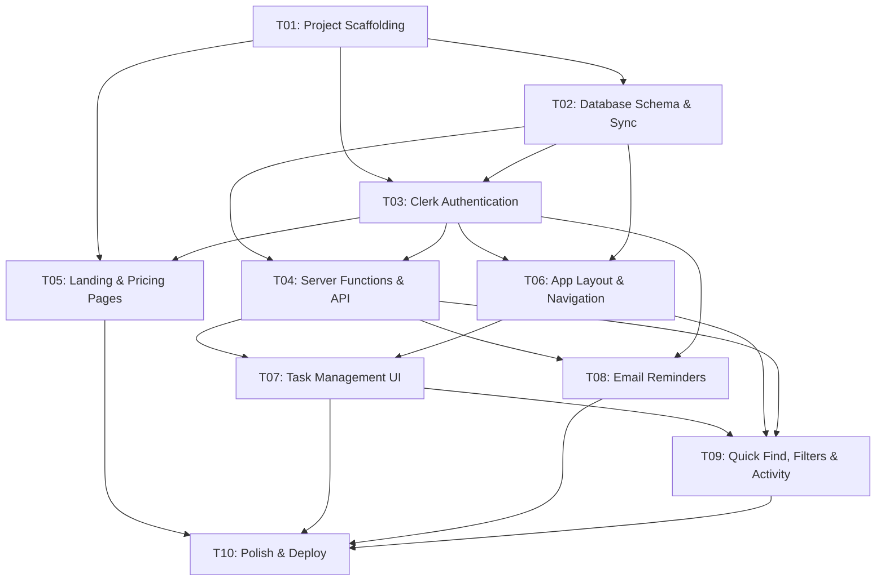

# DoMarrow — Implementation Tickets

## Ticket Overview

```
T01 → T02 → T03 → T04 → T05 ──→ T10
                    ↓      ↓
                   T06 → T07
                    ↓      ↓
                   T08    T09
                    ↓      ↓
                   T10 ←──┘
```

## Ticket Dependency Graph



## Ticket Summary

| Ticket | Name | Est. Effort | Dependencies |
|--------|------|-------------|-------------|
| T01 | Project Scaffolding & Infrastructure | 1 day | None |
| T02 | Database Schema & TanStack DB Sync | 2 days | T01 |
| T03 | Clerk Authentication Integration | 1-2 days | T01, T02 |
| T04 | Server Functions & API Layer | 2-3 days | T01, T02, T03 |
| T05 | Landing Page & Pricing Page | 2 days | T01, T03 |
| T06 | App Layout, Sidebar & Navigation | 2 days | T01, T02, T03 |
| T07 | Task Management UI (Four Sections) | 4-5 days | T04, T06 |
| T08 | Email Reminders via Resend | 1-2 days | T01-T04 |
| T09 | Quick Find, Filters & Activity | 2-3 days | T04, T06, T07 |
| T10 | Polish, Responsive & Deployment | 2-3 days | All |

**Total estimated effort: 18–25 days** (solo developer)

## Suggested Implementation Order

### Phase 1: Foundation (Days 1-4)
1. **T01**: Scaffold the project, install dependencies, configure Tailwind + Shadcn
2. **T02**: Set up Neon database, define schema, configure TanStack DB collections
3. **T03**: Integrate Clerk authentication, route protection, user provisioning

### Phase 2: Core Backend (Days 5-7)
4. **T04**: Build all server functions for CRUD operations

### Phase 3: UI — Marketing (Days 8-9)
5. **T05**: Build landing page and pricing page (can be done in parallel with T06)

### Phase 4: UI — App Shell (Days 8-9, parallel with T05)
6. **T06**: Build app layout, sidebar, navigation, project tabs

### Phase 5: UI — Core Feature (Days 10-14)
7. **T07**: Build the four-section task management UI (largest ticket)

### Phase 6: Secondary Features (Days 15-17, can be parallelized)
8. **T08**: Implement email reminders via Resend
9. **T09**: Build Quick Find, filter views, and activity history

### Phase 7: Ship (Days 18-20)
10. **T10**: Polish, responsive audit, deploy to Vercel

## Critical Path

The critical path runs through: **T01 → T02 → T03 → T04 → T06 → T07 → T10**

T07 (Task Management UI) is the most complex ticket and the highest risk. If any ticket needs to be split further, it's T07 — consider breaking it into:
- T07a: Add Task + Task Item components
- T07b: Task Detail Sheet
- T07c: Section 2 (Task List) + Section 4 (Future)
- T07d: Section 3 (Weekly View)
- T07e: Drag and Drop system
